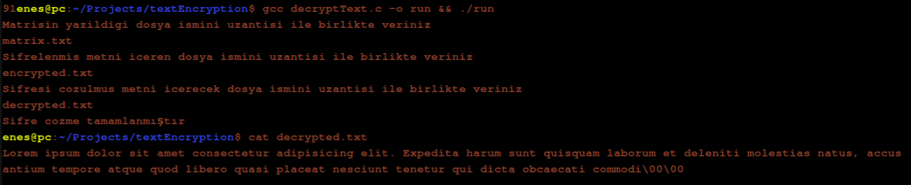

# Yazı Şifreleme
Bu bir şifreleme programıdır. Öncelikle şifrelemek ve daha sonrasında şifreyi çözmek için gerekli olacak karakter matrisi oluşturuyoruz. 
Daha sonrasında bu matrisi kullanarak elimizdeki şifrelenecek dosyayı şifreliyoruz. 
Bu matris sayesinde şifrelediğimiz metni geri çözebilmemiz için yine bu matrisi kullanmak zorundayız.
Son olarak da çözdüğümüz metni kayediyoruz.

## Programdan Görüntüler

1. Şifrelenecek metni görme amaçlı yazdırıyoruz. Daha sonra şifreleme için gerekli olan matrisi oluşturup ekrana bastırıyoruz.
  

     
2. Bu matrisi kullanarak şifrelenecek metni oluşturuyoruz ve oluşturduğumuz şifre dosyasını ekrana yazdırıyoruz.
  

     
3. Şifrelenen metni öncesinde oluşturduğumuz matris sayesinde tekrardan çözüyoruz. Çözdüğümüz dosyayı kaydedip yazdırıyoruz.
  

     
